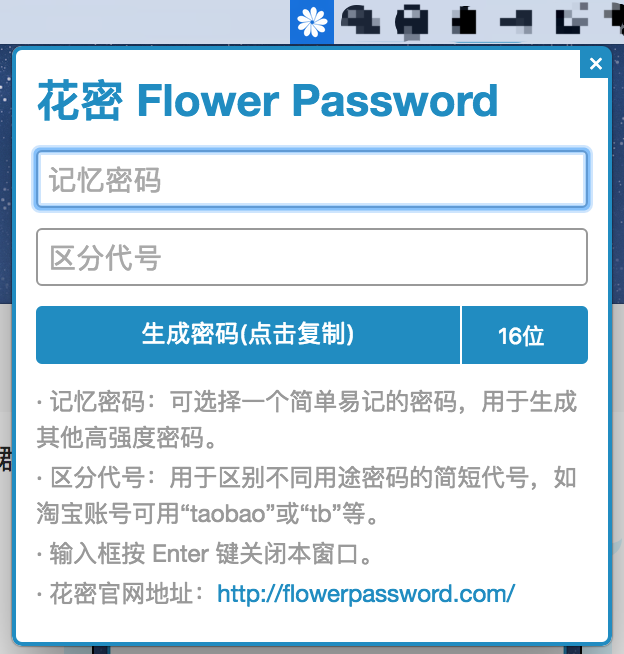

# flower-password-desktop
Flower Password Mac Desktop App, based on Electron.

## 0.全局快捷键

Command + Alt + S

## 1.“花密”是用来干什么的

“花密”提供一种简单的密码管理方法，你只需要记住一个“记忆密码”，为不同的账号设置不同的“区分代号”，然后通过“花密”计算就可以得到对应的不同的复杂密码。

## 2.“花密“”的计算过程

假设记忆密码为“123456”，区分代号为“taobao”，通过“花密”计算加密，得到最终密码为“KfdDf77F7D64e5c0”。虽然原来的记忆密码比较简单，但是经过花密处理，密码就变得强壮了。

## 3.如何使用“花密”

### A.设计一个和个人信息无关的“记忆密码”

（“记忆密码”可以由数字、大小写字母、符号或汉字组成）“记忆密码”是你唯一需要记忆的密码，为了防止社会工程学破解，请确保这个密码和你的个人信息无关且长度在6位以上，如生日、姓名拼音、手机号等都不能用来组成记忆密码。

### B.为需要加密的账号填写“区分代号”，使用“花密”计算出最终密码

（“区分代号”可以由数字、大小写字母、符号或汉字组成）如淘宝账号的区分代号可以设置成“taobao”、“tb”、“淘宝”等，注意不同的区分代号将会生成完全不同的最终密码。选择一种适合你的花密应用，如花密网页版，将“记忆密码”和“区分代号”填入，复制最终密码

### C.将原账号的密码修改成由“花密”计算出的最终密码

## 4.官网地址

https://flowerpassword.com/
